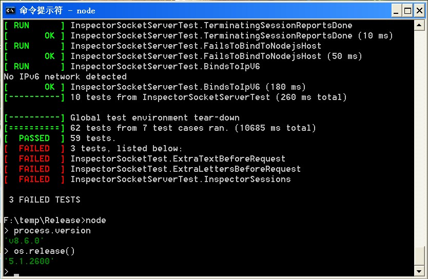


Sorry no English version, you can use translator https://fanyi.baidu.com/#zh/en/


Node.js官方从6.0开始就不再支持XP和Vista系统， 不过在浏览问题https://github.com/nodejs/node/issues/3804 时通过网友gdl-888的评论了解到跳过系统检查后实际上node v6是可以在xp上运行的， 于是当时在还未等到gdl-888回复具体方法时便开始尝试自己编译node去除限制，结果发现这并不难做到。

开始时在win10上使用vs2022带的v141_xp（对 VS 2017 (v141)工具的 C++ Windows XP 支持）编译，结果老是会链接XP上并没有的两个函数：InitializeCriticalSectionEx and LCMapStringEx。后来改为使用vs2015 update3在win7上编译则没有遇到这个问题（讽刺的是并不需要xp toolset）。编译成功v6.9.5后我又尝试了v6.17.1, v7.0.0, v7.10.1, v8.0.0， 都成功了， 直到v8.9.4才失败， v8.9.4编译出的exe链接了较多XP没有的函数，最后参考https://github.com/nodejs/node/issues/16603 确定最后一个能编译成功的版本是v8.6.0。编译出的v8.6.0二进制文件我压缩在Release/Release.zip， 可下载直接使用。下面是我在XP SP3上启动后的截图（XP SP2我不确定是否可以）：




对代码说明一下， 我的修改仅限于去除node启动时的操作系统版本检查和绕过XP没有的函数调用：

deps\v8\src\base\platform\time.cc： 完全参照https://github.com/riverar/v8/commit/98ec974c2576498eb07d01e26a2f849f59fed34c

deps\icu-small\source\i18n\winnmfmt.cpp ＆ windtfmt.cpp： 完全复制v6.17.1中的对应文件；

deps\icu-small\source\common\putil.cpp：完全复制v6.17.1中的对应文件；

其余文件修改很简单自己看。


另外，编译v6.17.1时我是修改了如下文件：


deps\uv\src\win\getaddrinfo.c：注释掉中间几行：
```c
int uv_if_indextoname(unsigned int ifindex, char* buffer, size_t* size) {
  NET_LUID luid;
  wchar_t wname[NDIS_IF_MAX_STRING_SIZE + 1]; /* Add one for the NUL. */
  DWORD bufsize;
  int r;

  if (buffer == NULL || size == NULL || *size == 0)
    return UV_EINVAL;

  //r = ConvertInterfaceIndexToLuid(ifindex, &luid);
  //
  //if (r != 0)
  //  return uv_translate_sys_error(r);

  //r = ConvertInterfaceLuidToNameW(&luid, wname, ARRAY_SIZE(wname));	// ding: fix for xp
  //
  //if (r != 0)
  //  return uv_translate_sys_error(r);

  /* Check how much space we need */
  bufsize = WideCharToMultiByte(CP_UTF8, 0, wname, -1, NULL, 0, NULL, NULL);

  if (bufsize == 0) {
    return uv_translate_sys_error(GetLastError());
  } else if (bufsize > *size) {
    *size = bufsize;
    return UV_ENOBUFS;
  }
```


另外， 网友gdl-888后来提供了直接修改node.exe跳过操作系统版本检查的方法： https://github.com/gdl-888/run-node-v6-windows-xp/blob/master/README.md


